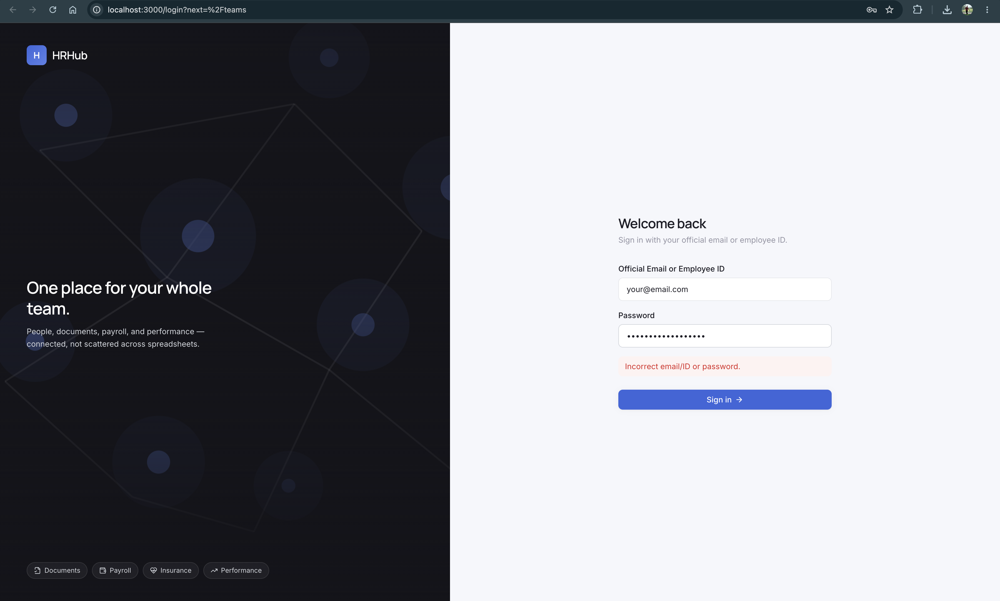
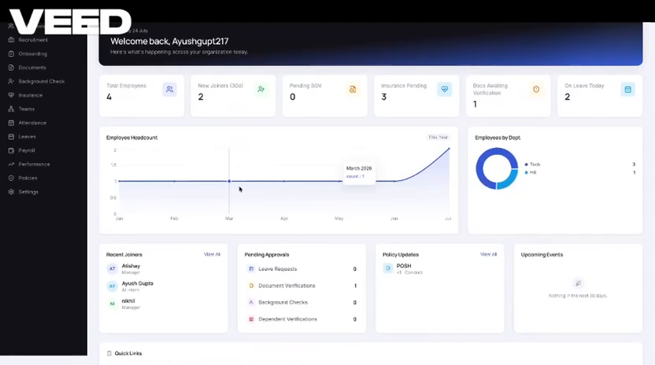
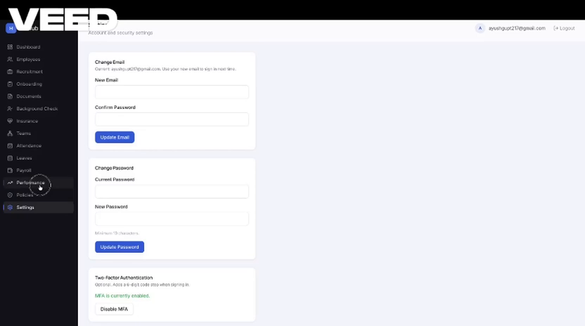
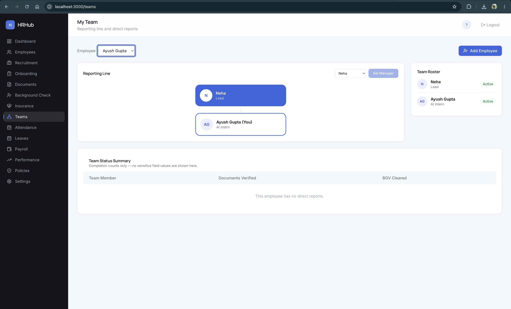
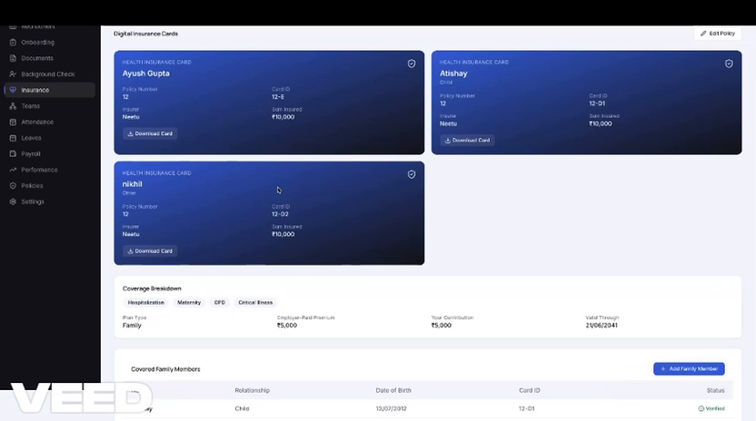
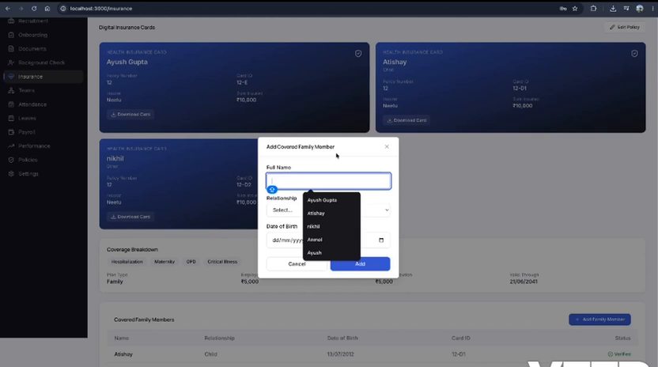
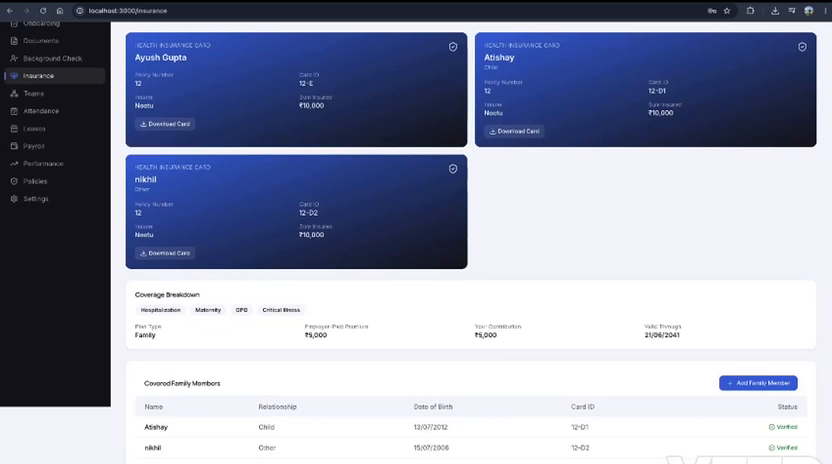

# HRHub — Enterprise HR Portal Dashboard

A full-stack enterprise HRMS: Next.js frontend, FastAPI backend, PostgreSQL,
Redis, and an nginx reverse proxy. HRHub brings the whole employee lifecycle
— onboarding, documents, background verification, insurance, reporting
lines, attendance, payroll, and performance — into one system of record
instead of scattered spreadsheets.



## Stack

| Layer       | Choice                                             |
|-------------|-----------------------------------------------------|
| Frontend    | Next.js 15 (App Router), TypeScript, Tailwind CSS   |
| Backend     | FastAPI (Python), async SQLAlchemy 2.0              |
| Database    | PostgreSQL 16                                        |
| Cache/Store | Redis 7                                              |
| Auth        | JWT (access + refresh), bcrypt, TOTP-based MFA       |
| Proxy       | nginx                                                |
| Deployment  | Docker Compose                                       |

## Features

- **Authentication & RBAC** — official email/employee ID login, bcrypt
  password hashing, JWT access + refresh tokens, server-side role
  re-validation on every request, account lockout after repeated failed
  attempts, and TOTP-based MFA for HR/System Admin roles
- **Employee master profile** — full CRUD with field-level visibility rules,
  so sensitive fields are only visible to HR Admin/Executive or the
  employee themselves
- **Recruitment & onboarding** — pipeline tracking from requisition through
  new-hire onboarding
- **Documents & background checks** — upload, verification status, and BGV
  tracking per employee
- **Insurance & policies** — plan enrollment and a company policy library
  with acknowledgment tracking
- **Teams** — a live reporting-line org chart (skip-level manager → direct
  manager → you → your direct reports) plus a team roster panel and a
  documents/BGV completion summary for your team
- **Attendance, leaves, payroll, performance** — the operational modules HR
  and managers use day to day
- **Full audit log** of login attempts and sensitive-field access

## Screenshots

**Dashboard**


**Employee Directory**


**Teams — Reporting Line & Roster**


**Documents**


**Payroll**


**Performance**


## Quick Start

**Prerequisites:** Docker & Docker Compose.

```bash
git clone https://github.com/ayush2459/enterprise-hrms.git
cd enterprise-hrms
./scripts/setup.sh
```

This copies `backend/.env.example` to `backend/.env`, builds every
container, runs Alembic migrations, and starts the stack.

Then create the first System Admin:

```bash
docker compose exec backend python scripts/create_admin.py \
  --email admin@yourcompany.com --password "ChangeMe123!"
```

- Frontend: http://localhost:3000
- Backend API docs: http://localhost:8000/docs
- Through nginx: http://localhost

**⚠️ Before any non-local deployment:** change `SECRET_KEY` and
`POSTGRES_PASSWORD` in `backend/.env` — the example values are placeholders,
not defaults you should ship with.

## Local development (without Docker)

**Backend**
```bash
cd backend
python -m venv .venv && source .venv/bin/activate
pip install -r requirements.txt
cp .env.example .env   # edit DATABASE_URL to point at a local Postgres
alembic upgrade head
uvicorn app.main:app --reload
```

**Frontend**
```bash
cd frontend
npm install
npm run dev
```

## Project Structure

```
enterprise-hrms/
├── frontend/     # Next.js app (App Router, TS, Tailwind)
├── backend/      # FastAPI app (async SQLAlchemy, Alembic, JWT auth)
├── database/     # init.sql — extensions only; schema is Alembic-owned
├── docker/       # nginx reverse proxy config, postgres overrides
├── docs/         # specification documents + screenshots
├── scripts/      # setup + admin bootstrap scripts
└── docker-compose.yml
```

## What's implemented

- Official email / Employee ID login, bcrypt password hashing
- JWT access (15 min) + refresh (7 day) tokens, role claim embedded
- Server-side RBAC re-validated on every request (not just at login)
- Account lockout after 5 failed attempts, MFA (TOTP) for HR/System Admin
- Full audit log of login attempts and sensitive-field access
- Employee master profile: CRUD with field-level visibility rules
  (sensitive fields only visible to HR Admin/Executive or the employee)
- Reporting-line org chart with skip-level manager, roster panel, and team
  status summary
- Dashboard shell, sidebar navigation, employee directory table

## What's next

Documents/BGV pipeline hardening, insurance module expansion, HR policies
library, reporting, and a hardening pass (field-level encryption, DPDP
compliance review, load testing).

## License

See [LICENSE](./LICENSE).
